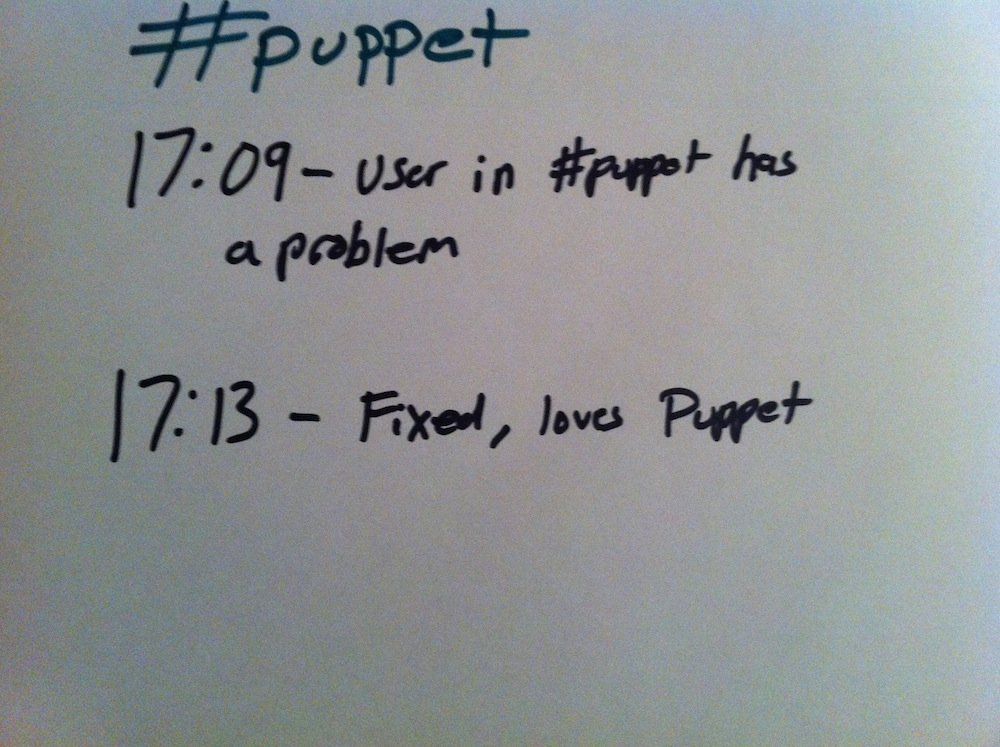
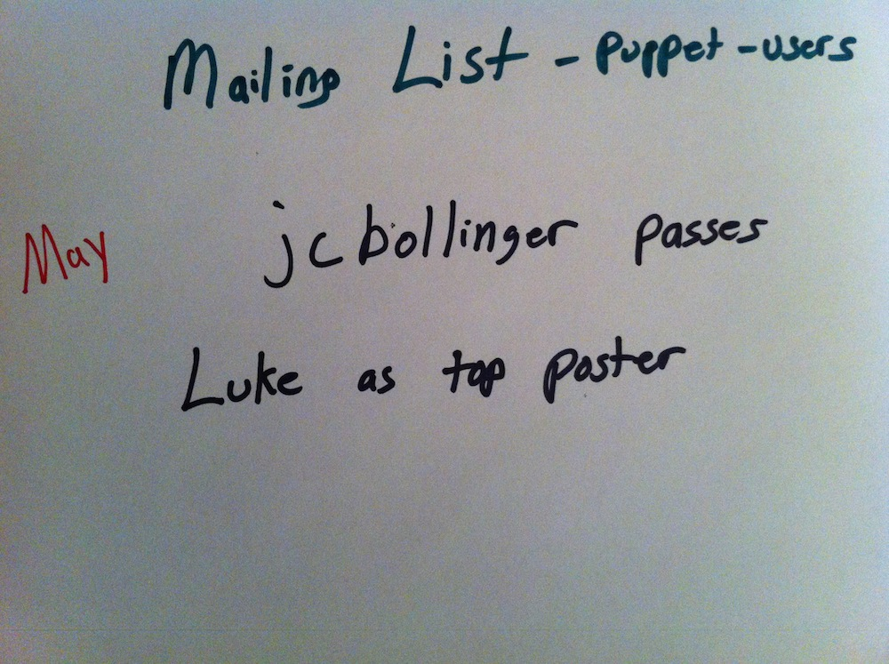

!SLIDE center 

<!SLIDE >
# Who is our community? #

* Users and customers of our products (FOSS/PE)

* Partners, Investors (Cisco, VMware, Google, EMC, Morphlabs, etc)

* Employees of Puppet Labs

* Primarily system administrators, but not always

<!SLIDE center >

<!SLIDE>
# Why have a community?

* Eliminate Infrastructure Problems

* Allow system administrators to work on interesting problems rather than the mundane

<!SLIDE>
# Measuring Community

<!SLIDE center >

!SLIDE
Awareness: Finding the community and visiting to learn more

(potential community members)

<!SLIDE >
Membership: Taking time to join the community

(passive and active community members)

<!SLIDE  >
Engagement: Interacting with other community members

(active community members)

<!SLIDE  >
Development: Engaging with projects from Puppet Labs at a code level

(developers)

<!SLIDE center  >

<!SLIDE center  >

<!SLIDE center >

<!SLIDE center>

<!SLIDE center>

<!SLIDE center>

<!SLIDE center>

<!SLIDE center>

<!SLIDE center>

<!SLIDE center>

<!SLIDE center>

<!SLIDE center>

<!SLIDE center>

<!SLIDE center>

<!SLIDE center>

<!SLIDE center>

<!SLIDE center>

<!SLIDE center>

<!SLIDE center>

<!SLIDE center>

<!SLIDE center>

<!SLIDE center>

<!SLIDE center>

<!SLIDE center >

<!SLIDE center >

<!SLIDE center>

<!SLIDE>
# Aligning our Community

* A strong community is built on transparency

* Community enables customer delight

<!SLIDE center>
# Established Community Practices

* User Groups
* Mailing Lists
* IRC
* Puppet Camps

<!SLIDE center>
# Past Community Experiments

* Triage-a-thon
* Twitter Chat
* Module Hackathon

<!SLIDE center >

<!SLIDE smaller>
# Past Community Wins
* Native package repos (yum, apt)
* RC package repos
* Openstack Work
* PuppetCamp explosion
* May 2012 is our biggest open source month ever

<!SLIDE center >

<!SLIDE>
# Focus Areas

## Reduce entry friction to be involved in the Puppet Community (membership, development)

<!SLIDE center >

<!SLIDE>
* Revamp of the community website
* Ensure multiple types of contributors can exist (not just coders)
* Enhance recognition
* Q&A Site
* Direct interaction with developers

<!SLIDE>
# Focus Areas

##  Share the development of our open source projects (development)

<!SLIDE>
* Smooth over contribution processes
* Showcase contributors doing great things
* Get community contributors to maintain Puppet Labs modules on the forge
* Showcase Module of the week posts from the community
* Ensure community feedback in roadmap for Waldorf

<!SLIDE>
# Focus Areas

##  Build a non-development community (engagement, membership)

<!SLIDE>
* Create an advocate/ambassador process
* Enhance ability to contribute to docs
* Build a community website with user-generated content
* Allow community participation in design

<!SLIDE>
# Focus Areas

## Feature the community as a differentiator (awareness, engagement)

<!SLIDE>
* Videos of design, coding, conversations
* Puppet campaigns with community around "I love Puppet"
* Possible campaigns of "Craziest use of Puppet" or "Puppet Abuse"
* Showcase infrastructure knowledge of the community

<!SLIDE>
# Next 60 Days
<!SLIDE smaller>
# May
* Utilize the community pages until .org is launched
* Publicize contributor roles document
* Review need for CLA on all types of projects
* Begin working with platform team on onboarding process
* Experiment with office hours for developers

<!SLIDE smaller>
# June
* Pilot Puppet Community Podcast
* Prototype the Q&A Site internally
* Revisit redmine vs github issues
* Prioritize community feedback based on ticket voting
* Conduct online module seminar (video, or class)

<!SLIDE smaller>
# June
* Host module hack event
* Review contribution recognition strategies
* Launch pairing with a developer activities
* Work on onboarding/recruiting platform owners and community QA people
* Showcase Puppet roadmap for open source projects

<!SLIDE center >

<!SLIDE smaller>
# PuppetConf
* Community Focus in one room
* Hackathon events
* OpenSpaces

<!SLIDE smaller>
# Long Term Ideas
* Create Puppet community profiles platform
* Provide an @puppetproject.org email address for contributors
* Create merit badges
* Figure out single sign-on

<!SLIDE center >

<!SLIDE>
# Convergence
* Collaboration platform for the community
* Integrate all avenues of user-generated content
* Combine with recognition

<!SLIDE>
# Call to action
* Help with IRC, lists, github, redmine, twitter
* Collaborate and educate
* Blog/Video/Design content
* Recognition ideas
* Wear a tattoo

<!SLIDE center >

